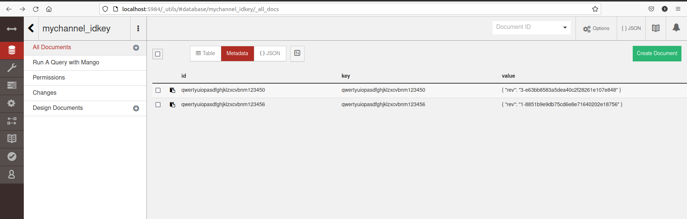

# Build it 

+ 克隆当前仓库，执行：`bash ./startFabric.sh`即可完成fabric网络的部署、`chaincode`的安装和实例化、测试数据的插入。
+ 首次运行脚本之前，需要先执行`bash ./bootstart.sh -s -b`来下载所需的镜像
# Visit database

+ 访问：`localhost:5984/_utils/#database/mychannel_idkey/`即可查看`mychannel`通道的`idkey`链码上已经同步的数据。

  

# CMD:[Insert <id,key> 、Query key] 

+ 进入`cli`容器：`docker exec -it cli bash`

+ 执行下述命令进入<id,key>对的插入(下述的-c指定传给`chaincode`的参数)：

  ```bash
  peer chaincode invoke -o orderer.example.com:7050 --tls true --cafile /opt/gopath/src/github.com/hyperledger/fabric/peer/crypto/ordererOrganizations/example.com/orderers/orderer.example.com/msp/tlscacerts/tlsca.example.com-cert.pem -C mychannel -n idkey --peerAddresses peer0.org1.example.com:7051 --tlsRootCertFiles /opt/gopath/src/github.com/hyperledger/fabric/peer/crypto/peerOrganizations/org1.example.com/peers/peer0.org1.example.com/tls/ca.crt --peerAddresses peer0.org2.example.com:9051 --tlsRootCertFiles /opt/gopath/src/github.com/hyperledger/fabric/peer/crypto/peerOrganizations/org2.example.com/peers/peer0.org2.example.com/tls/ca.crt -c '{"Args":["insertIdKeyPair","qwertyuiopasdfghjklzxcvbnm123456","230"]}'
  ```

+ 执行下述命令对上述插入的值进行查询：

  ```bash
  peer chaincode query -C mychannel -n idkey -c '{"Args":["queryKey","qwertyuiopasdfghjklzxcvbnm123456"]}'
  ```
  

注意：重复插入同一id，会插入失败。

# 调用SDK ： [Insert <id,key> 、Query key] 

+ 进入`client/javascript/`目录；

+ 执行：

  ```bash
  # 根据package.json安装相应的环境
  npm install 
  
  #注册admin
  node enrollAdmin.js
  
  #注册组织1的client用户user1
  node registerUser.js
  
  # 使用user1插入<id,key>对
  node invoke.js 
  node query.js
  
  # 使用参数插入，第一个参数为id，长度为32；第二个参数为key，为int值
  node invoke.js qwertyuiopasdfghjklzxcvbnm123456 230
  node query.js qwertyuiopasdfghjklzxcvbnm123456
  ```

  


使用`javascript`调用智能合约，实现`admin`、`user1`注册，并使用注册用户进行通过调用智能合约与链码进行交互，获取`ledger`的信息。具体的代码在`client/javascript`文件夹下，可点击下述链接跳转。`invoke.js`是插入<id.key>对的代码，`query.js`是查询key的代码，这两个过程的核心代码见下述说明。

+ [enrollAdmin.js](./client/javascript/enrollAdmin.js)

+ [registerUser.js](./client/javascript/registerUser.js)

+ [invoke.js](./client/javascript/invoke.js)

  ```js
  		var args = new Array()
      	var id;
      	var key;
      	args = process.argv.slice(2);
      	
      	// If there aren't any args,insert the default <id,key>pair
      	if (args.length == 0) {
      		id = "qwertyuiopasdfghjklzxcvbnm123456";
      		key = 230;
      	}
      	else if(args.length == 2) {
      		id = args[0];
      		key = args[1];
      	}
      	else {
      		console.log('the number of args is 2');
      		return;
      	}
  
      	if(id.length != 32) {
      		console.log('the length of id is not 32');
      		return;
      	}
  
          // Create a new file system based wallet for managing identities.
          const walletPath = path.join(process.cwd(), 'wallet');
          const wallet = new FileSystemWallet(walletPath);
          console.log(`Wallet path: ${walletPath}`);
  
          // Check to see if we've already enrolled the user.
          const userExists = await wallet.exists('user1');
          if (!userExists) {
              console.log('An identity for the user "user1" does not exist in the wallet');
              console.log('Run the registerUser.js application before retrying');
              return;
          }
  
          // Create a new gateway for connecting to our peer node.
          const gateway = new Gateway();
          await gateway.connect(ccpPath, { wallet, identity: 'user1', discovery: { enabled: true, asLocalhost: true } });
  
          // Get the network (channel) our contract is deployed to.
          const network = await gateway.getNetwork('mychannel');
  
          // Get the contract from the network.
          const contract = network.getContract('idkey');
  
          // Submit the specified transaction.
  
          await contract.submitTransaction('insertIdKeyPair',id,key);
          console.log('Transaction has been submitted');
  
          // Disconnect from the gateway.
          await gateway.disconnect();
  ```

+ [query.js](./client/javascript/query.js)

  ```js
  var args = new Array()
  	var id;
  	args = process.argv.slice(2);
  	if (args.length == 0) {
      		id = "qwertyuiopasdfghjklzxcvbnm123456";
      	}else if(args.length == 1) {
      		id = args[0];
      	}
      	else {
      		console.log('the number of args is 1');
      		return;
      	}
      	console.log(id);
          // Create a new file system based wallet for managing identities.
          const walletPath = path.join(process.cwd(), 'wallet');
          const wallet = new FileSystemWallet(walletPath);
          console.log(`Wallet path: ${walletPath}`);
  
          // Check to see if we've already enrolled the user.
          const userExists = await wallet.exists('user1');
          if (!userExists) {
              console.log('An identity for the user "user1" does not exist in the wallet');
              console.log('Run the registerUser.js application before retrying');
              return;
          }
  
          // Create a new gateway for connecting to our peer node.
          const gateway = new Gateway();
          await gateway.connect(ccpPath, { wallet, identity: 'user1', discovery: { enabled: true, asLocalhost: true } });
  
          // Get the network (channel) our contract is deployed to.
          const network = await gateway.getNetwork('mychannel');
  
          // Get the contract from the network.
          const contract = network.getContract('idkey');
  
          // Evaluate the specified transaction.
  
          const result = await contract.evaluateTransaction('queryKey',id);
          console.log(`Transaction has been evaluated, result is: ${result.toString()}`);
  ```

  

# Smart Contract

智能合约由`go`语言编写，位于[`chaincode/idkey/go`](./chaincode/idkey/go/idkey.go)目录下。在运行[`./startFabric.sh`](./startFabric.sh)的时候已经将该智能合约代码`install`到了`org1`和`org2`的锚节点`peer0.org1.example.com`和`peer0.org2.example.com`上。并完成了在`mychannel`上的实例化和测试数据的插入。核心代码；示例如下：

```bash
# 进入cli容器，并在安装peer0.org2.example.com上install链码,在peer0.org1.example.com上安装的写法类似，详细参见./startFabric.sh文件。
docker exec \
  -e CORE_PEER_LOCALMSPID=Org2MSP \
  -e CORE_PEER_ADDRESS=peer0.org2.example.com:9051 \
  -e CORE_PEER_MSPCONFIGPATH=${ORG2_MSPCONFIGPATH} \
  -e CORE_PEER_TLS_ROOTCERT_FILE=${ORG2_TLS_ROOTCERT_FILE} \
  cli \
  peer chaincode install \
    -n idkey \
    -v 1.0 \
    -p "$CC_SRC_PATH" \
    -l "$CC_RUNTIME_LANGUAGE"
    
# 实例化chaincode
docker exec \
  -e CORE_PEER_LOCALMSPID=Org1MSP \
  -e CORE_PEER_MSPCONFIGPATH=${ORG1_MSPCONFIGPATH} \
  cli \
  peer chaincode instantiate \
    -o orderer.example.com:7050 \
    -C mychannel \
    -n idkey \
    -l "$CC_RUNTIME_LANGUAGE" \
    -v 1.0 \
    -c '{"Args":[]}' \
    -P "AND('Org1MSP.member','Org2MSP.member')" \
    --tls \
    --cafile ${ORDERER_TLS_ROOTCERT_FILE} \
    --peerAddresses peer0.org1.example.com:7051 \
    --tlsRootCertFiles ${ORG1_TLS_ROOTCERT_FILE}
    
# 测试数据的插入
docker exec \
  -e CORE_PEER_LOCALMSPID=Org1MSP \
  -e CORE_PEER_MSPCONFIGPATH=${ORG1_MSPCONFIGPATH} \
  cli \
  peer chaincode invoke \
    -o orderer.example.com:7050 \
    -C mychannel \
    -n idkey \
    -c '{"Args":["insertIdKeyPair","qwertyuiopasdfghjklzxcvbnm123450","230"]}' \
    --waitForEvent \
    --tls \
    --cafile ${ORDERER_TLS_ROOTCERT_FILE} \
    --peerAddresses peer0.org1.example.com:7051 \
    --peerAddresses peer0.org2.example.com:9051 \
    --tlsRootCertFiles ${ORG1_TLS_ROOTCERT_FILE} \
    --tlsRootCertFiles ${ORG2_TLS_ROOTCERT_FILE}
```

智能合约核心代码如下：

```go
//Init函数在链码实例化的时候执行
func (s *SmartContract) Init(APIstub shim.ChaincodeStubInterface) sc.Response {
	return shim.Success(nil)
}

//Invoke函数接受该智能合约被调用时传来的参数
func (s *SmartContract) Invoke(APIstub shim.ChaincodeStubInterface) sc.Response {


	function, args := APIstub.GetFunctionAndParameters()
	if function == "queryKey" {
		return s.queryKey(APIstub, args)
	} else if function == "insertIdKeyPair" {
		return s.insertIdKeyPair(APIstub, args)
	}

	return shim.Error("Invalid Smart Contract function name.")
}
// 查询指定id的key值，如果不存在，则返回Error
func (s *SmartContract) queryKey(APIstub shim.ChaincodeStubInterface, args []string) sc.Response {
	fmt.Println("ex02 queryKey")
	var id string
	var err error

	if len(args) != 1 {
		return shim.Error("Incorrect number of arguments. Expecting id to query")
	}

	id = args[0]
	
	keyAsBytes, err := APIstub.GetState(id)
	if err != nil {
		jsonResp := "{\"Error\":\"Failed to get state for" + id + "\"}"
		return shim.Error(jsonResp)
	}
	
	if keyAsBytes == nil {
		jsonResp := "{\"Error\":\"Nil key for " + id + "\"}"
		return shim.Error(jsonResp)
	}
	
	jsonResp := "{\"id\":\"" + id + "\",\"key\":\"" + string(keyAsBytes) + "\"}"
	fmt.Printf("Query Response:%s\n", jsonResp)
	return shim.Success(keyAsBytes)
}
// 插入<id,key>，只有满足
// 1. id长度为32
// 2. 该id没有被插入过
// 才会将传来的<id,key>插入ledger
func (s *SmartContract) insertIdKeyPair(APIstub shim.ChaincodeStubInterface, args []string) sc.Response {

	var id string
	var key int
	var err error
	var e error
	
	if len(args) != 2 {
		return shim.Error("Incorrect number of arguments. Expecting 2")
	}

	id = args[0]
	idlength := utf8.RuneCountInString(id)
	if idlength != 32 {
		return shim.Error("Incorrect id. Expecting id length is 32")
	}

	keyAsBytes, err := APIstub.GetState(id)
	if err != nil {
		return shim.Error(err.Error())
	}

	if keyAsBytes == nil {
		key, e = strconv.Atoi(args[1])
		if e != nil {
			return shim.Error("Expecting integer value for key")
		}
		fmt.Printf("id = %d, key = %d\n", id, key)

		APIstub.PutState(id, []byte(strconv.Itoa(key)))

		return shim.Success(nil)
	}
	
	jsonResp := "{\"Error\":\"id: "+ id + "aleary exists\"}"
	return shim.Error(jsonResp)
}
```


