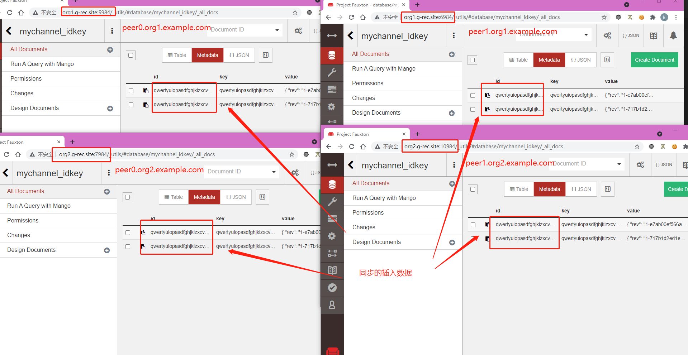

# 实验环境配置说明

采用三台虚拟机部署fabric网络（solo）。三台虚拟机的具体配置如下（该文档以主机名表示每台服务器，ip根据实验实际情况替换）：

| 主机名(默认配置的域名) | 角色                                                         |
| -------------------  | ------------------------------------------------------------ |
| orderer.example.com  | orderer排序服务器                                             |
| org1.example.com     | 组织1（包含peer0.org1.example.com、peer1.org1.example.com两个节点） |
| org2.example.com     | 组织2（包含peer0.org2.example.com、peer1.org2.example.com两个节点） |

注意：
+ 想要在其它机器上部署该项目，需将仓库目录`./fabric_idkey/first-network`下的`peer0.org1.yaml`、`peer1.org1.yaml`、`peer0.org2.yaml`、`peer1.org2.yaml`中的`extra_hosts`字段对应的ip替换为实际使用的ip，以及`crypto-config.yaml`文件中的`SANS`字段的ip，然后按照下述的文档进行即可。
+ 若要运行客户端,另外需修改`./fabric_idkey/first-network/ccp-generate.sh`文件中的`URL`字段，以确保客户端能访问到正确的服务器地址。
+ 在此项目中，分别使用`192.168.0.101`，`192.168.0.102`，`192.168.0.103`作为上述三台服务器的ip。
# fabric多机多节点部署过程
## Step1: Run the tools
注：下述代码中使用`{}`括起来的均为变量，可以使用真实实验所具有的服务器ip和对应的用户名替换。
+ 登陆{orderer.example.com}进行证书生成等工作；
```bash
ssh {username}@{orderer.example.com} #登陆orderer.example.com

# 克隆当前仓库
git clone https://github.com/kate123wong/fabric_idkey.git 

cd fabric_idke

# `bysn.sh`脚本使用`crypto-config.yaml`和`configtx.yaml`配置文件来生成orderer和组织的证书、创建初始区块、创建系统channel
bash ./first-network/bysn.sh generate
```
+ 将生成的证书和初始区块分发到{org1.example.com}节点和{org2.example.com}节点；
```bash
#进入上级目录，压缩整个包
cd ../
tar -cvf fabric_idkey.tar fabric_idkey/

#将数据包拷贝到org1.example.com和org2.example.com
scp ./fabric_idkey.tar {username1}@{org1.example.com}:/home/{username1}
scp ./fabric_idkey.tar {username2}@{org2.example.com}:/home/{username2}
```

## Step2: Start network

注意：非实验机器慎用，下面脚本会删除无用的容器卷和docker网络和容器。下述操作无特殊说明均在`fabric_idke/first-network/`目录下。

```bash
#在{ orderer.example.com}上：
bash ./startorder.sh
#在{org1.example.com}上：
bash ./startorg1.sh
#在{org1.example.com}上：
bash ./startorg2.sh
```
## Step3: Create & Join Channel
+ 登录{org1.example.com}，进入`cli`
```bash
docker exec -it cli bash

#创建应用通道mychannel
peer channel create -o orderer.example.com:7050 -c mychannel -f ./channel-artifacts/channel.tx --outputBlock ./channel-artifacts/mychannel.block

#将peer0.org1.example.com加入mychannel通道
peer channel join -b ./channel-artifacts/mychannel.block

#将peer1.org1.example.com加入mychannel通道
CORE_PEER_TLS_ENABLED=false CORE_PEER_LOCALMSPID="Org1MSP"  CORE_PEER_MSPCONFIGPATH=/opt/gopath/src/github.com/hyperledger/fabric/peer/crypto/peerOrganizations/org1.example.com/users/Admin@org1.example.com/msp CORE_PEER_ADDRESS=peer1.org1.example.com:8051 peer channel join -b ./channel-artifacts/mychannel.block

#将应用通道拷贝到org2.example.com
scp ./channel-artifacts/mychannel.block {username2}@org2.example.com:home/{username2}/fabric_idkey/first-network/channel-artifacts
```
+ 进入{org2.example.com}
```bash
docker exec -it cli bash

#将peer0.org2.example.com加入mychannel通道
peer channel join -b ./channel-artifacts/mychannel.block
#将peer1.org2.example.com加入mychannel通道
 CORE_PEER_LOCALMSPID="Org2MSP" CORE_PEER_MSPCONFIGPATH=/opt/gopath/src/github.com/hyperledger/fabric/peer/crypto/peerOrganizations/org2.example.com/users/Admin@org2.example.com/msp CORE_PEER_ADDRESS=peer1.org2.example.com:10051 peer channel join -b ./channel-artifacts/mychannel.block
```
## Step4: Update the anchor peers
```bash
#Update the anchor peers
#在{org1.example.com}：
 peer channel update -o orderer.example.com:7050 -c mychannel -f ./channel-artifacts/Org1MSPanchors.tx
# 在{org2.example.com}：
 peer channel update -o orderer.example.com:7050 -c mychannel -f ./channel-artifacts/Org2MSPanchors.tx
```
## Step5：Install & Instantiate Chaincode
+ 在{org1.example.com}上安装链码
```bash
docker exec -it cli bash
#在peer0.org1.example.co安装链码
peer chaincode install -n idkey -p github.com/chaincode/idkey/go -v 1.0
#设置环境变量，将peer1.org1.example.com加入mychannel通道
CORE_PEER_TLS_ENABLED=false CORE_PEER_LOCALMSPID="Org1MSP"  CORE_PEER_MSPCONFIGPATH=/opt/gopath/src/github.com/hyperledger/fabric/peer/crypto/peerOrganizations/org1.example.com/users/Admin@org1.example.com/msp CORE_PEER_ADDRESS=peer1.org1.example.com:8051 peer chaincode install -n idkey -p github.com/chaincode/idkey/go -v 1.0
```
+ 在{org2.example.com}上安装链码

```bash
docker exec -it cli bash
#在peer0.org2.example.co安装链码
peer chaincode install -n idkey -p github.com/chaincode/idkey/go -v 1.0
#设置环境变量，将peer1.org2.example.com加入mychannel通道
 CORE_PEER_LOCALMSPID="Org2MSP" CORE_PEER_MSPCONFIGPATH=/opt/gopath/src/github.com/hyperledger/fabric/peer/crypto/peerOrganizations/org2.example.com/users/Admin@org2.example.com/msp CORE_PEER_ADDRESS=peer1.org2.example.com:10051 peer chaincode install -n idkey -p github.com/chaincode/idkey/go -v 1.0
```
+ 在{org1.example.com}上实例化链码:
```bash
docker exec -it cli bash
#实例化链码
peer chaincode instantiate -o orderer.example.com:7050 -C mychannel -n idkey -l golang -v 1.0 -c '{"Args":[]}' -P  "AND('Org1MSP.member','Org2MSP.member')" 
```
## Step6: Invoke & Query
+ 在{org1.example.com}或{org2.example.com}的peer0节点查询上：
```bash
#插入数据
docker exec -it cli bash
peer chaincode invoke -o orderer.example.com:7050 -C mychannel -n idkey --peerAddresses peer0.org1.example.com:7051 --peerAddresses peer0.org2.example.com:9051 -c '{"Args":["insertIdKeyPair","qwertyuiopasdfghjklzxcvbnm123456","230"]}'

#查询插入数据
peer chaincode query -C mychannel -n idkey -c '{"Args":["queryKey","qwertyuiopasdfghjklzxcvbnm123456"]}'
```
+ 在{org1.example.com}或{org2.example.com}的peer1节点查询上：
以下命令在对应主机的cli容器执行
```bash
#连接{peer1.org1.example.com}查询数据:
CORE_PEER_TLS_ENABLED=false CORE_PEER_LOCALMSPID="Org1MSP"  CORE_PEER_MSPCONFIGPATH=/opt/gopath/src/github.com/hyperledger/fabric/peer/crypto/peerOrganizations/org1.example.com/users/Admin@org1.example.com/msp CORE_PEER_ADDRESS=peer1.org1.example.com:8051 peer chaincode query -C mychannel -n idkey -c '{"Args":["queryKey","qwertyuiopasdfghjklzxcvbnm123456"]}'

#连接{peer1.org2.example.com}查询数据:
CORE_PEER_LOCALMSPID="Org2MSP" CORE_PEER_MSPCONFIGPATH=/opt/gopath/src/github.com/hyperledger/fabric/peer/crypto/peerOrganizations/org2.example.com/users/Admin@org2.example.com/msp CORE_PEER_ADDRESS=peer1.org2.example.com:10051  peer chaincode query -C mychannel -n idkey -c '{"Args":["queryKey","qwertyuiopasdfghjklzxcvbnm123456"]}'
```


# Visit database

# 客户端访问fabric网络


```bash
#克隆仓库
git clone https://github.com/kate123wong/fabric_idkey.git 

cd fabric_idke/client
```

```bash
# 根据package.json安装相应的环境
npm install 

#注册admin
node enrollAdmin.js

#注册组织1的client用户user1
node registerUser.js

# 使用user1插入<id,key>对
node invoke.js
node query.js

# 使用参数插入，第一个参数为id，长度为32；第二个参数为key，为int值
node invoke.js qwertyuiopasdfghjklzxcvbnm123456 230
node query.js qwertyuiopasdfghjklzxcvbnm123456
```
